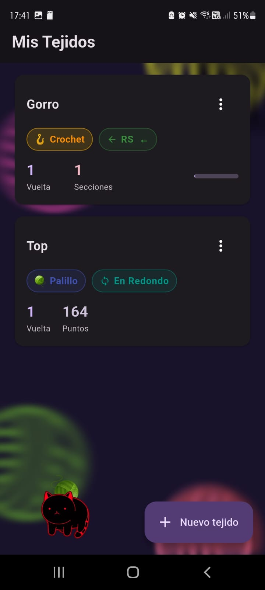
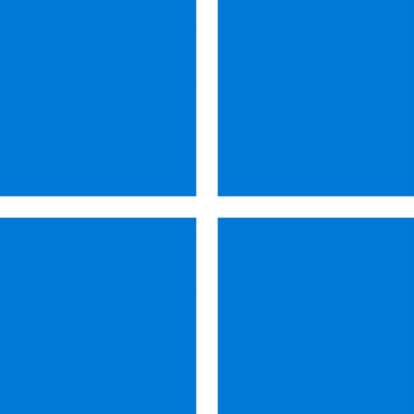

# Tejido Counter

Contador de vueltas y puntos para proyectos de tejido (Crochet y Palillo). Permite organizar proyectos en secciones, llevar el conteo de filas, distinguir entre derecho (RS) y revés (WS), y trabajar tanto en plano como en redondo.

## Preview

<!-- Guardá los screenshots en docs/preview/ y referencialos acá -->


## Stack

### Frontend
- **Flutter 3.10+** (multi-plataforma: Android, iOS, Windows)
- **Dart 3**
- **Provider 6** (state management)
- **shared_preferences 2** (persistencia local)
- **flutter_svg 2** (renderizado de SVGs / fondos animados)
- **uuid 4** (identificadores únicos de proyectos/secciones)
- **cupertino_icons** (íconos estilo iOS)

<!-- Guardá los logos en docs/stack/ y referencialos acá -->
<p align="left">
  
  
</p>

### Plataformas soportadas
- **Android**
- **iOS**
- **Windows** (desktop)

<p align="left">
  
  
  
</p>

## Features

| Feature                | Descripción                                                                 |
|------------------------|-----------------------------------------------------------------------------|
| Modos de tejido        | Soporte para **Crochet** y **Palillo**                                      |
| Estilos de trabajo     | **Plano** (con distinción RS/WS) y **En redondo**                           |
| Secciones por proyecto | Dividí cada proyecto en secciones con cantidad de filas y nombre            |
| Conteo de filas        | Avance/retroceso por fila con indicador de progreso por sección y total    |
| Dirección de lectura   | Muestra dirección de chart (derecho ← / revés →) según RS o WS              |
| Persistencia local     | Los proyectos se guardan en el dispositivo con `shared_preferences`         |
| Fondo animado          | Animaciones de hilo y un gatito jugando con la lana                         |

## Estructura del proyecto

```
lib/
├── main.dart
├── models/
│   └── project.dart            # Project + ProjectSection + enums (TejidoMode, WorkStyle)
├── providers/
│   └── projects_provider.dart  # State management + persistencia
├── screens/
│   ├── home_screen.dart        # Lista de proyectos
│   ├── edit_project_screen.dart
│   ├── sections_screen.dart    # Gestión de secciones
│   └── counter_screen.dart     # Contador principal
└── widgets/
    ├── counter_tile.dart
    ├── direction_badge.dart
    ├── section_progress_card.dart
    ├── animated_yarn_background.dart
    └── yarn_cat_overlay.dart
```

## Getting Started

### Requisitos
- Flutter SDK `^3.10.4`
- Dart SDK 3+

### Instalar dependencias

```bash
flutter pub get
```

### Correr en desarrollo

```bash
# Android / iOS (dispositivo o emulador conectado)
flutter run

# Windows desktop
flutter run -d windows
```

### Build para producción

```bash
# Android (APK)
flutter build apk --release

# Android (App Bundle para Play Store)
flutter build appbundle --release

# iOS
flutter build ios --release

# Windows
flutter build windows --release
```

## Assets

```
assets/
├── bg_svgs/      # SVGs del fondo animado de hilo
└── cat_frames/   # Frames del overlay del gato

docs/
├── preview/      # Screenshots de la app (preview.jpg, etc.)
└── stack/        # Logos del stack (flutter.png, dart.png, ...)
```
